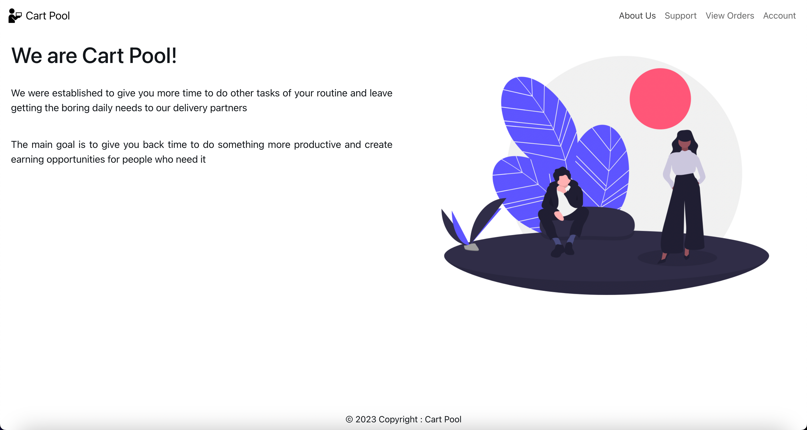
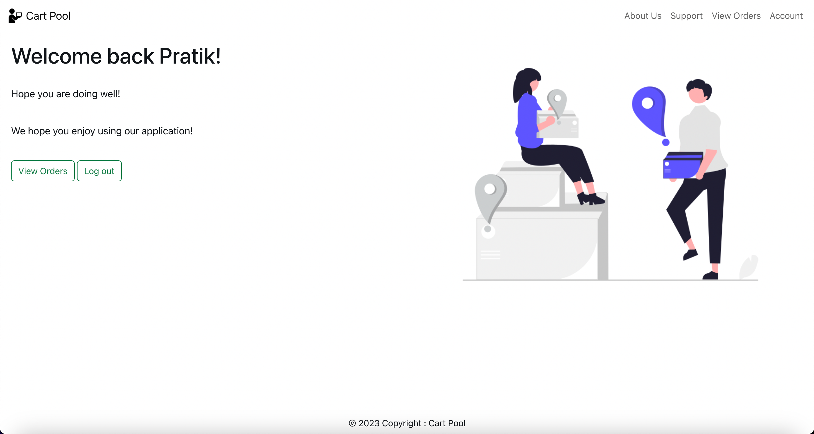
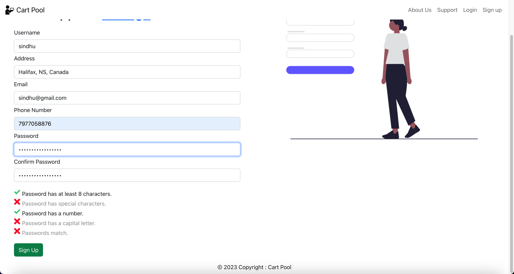
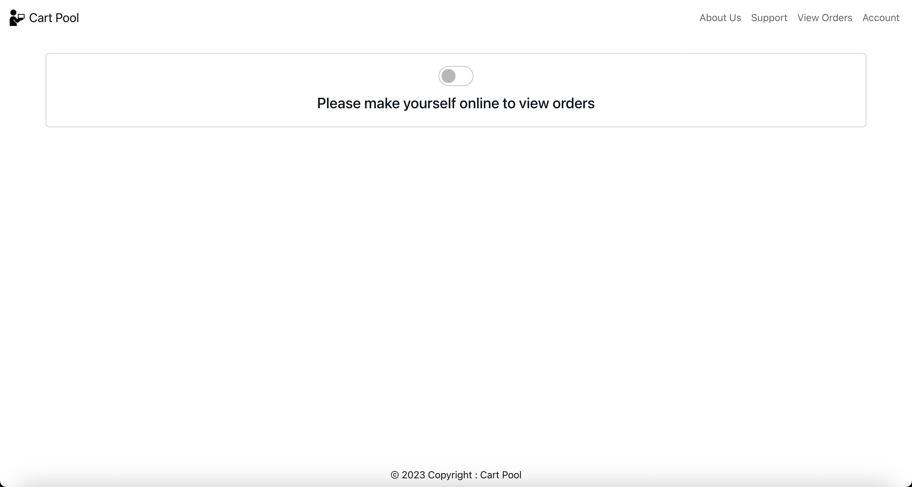
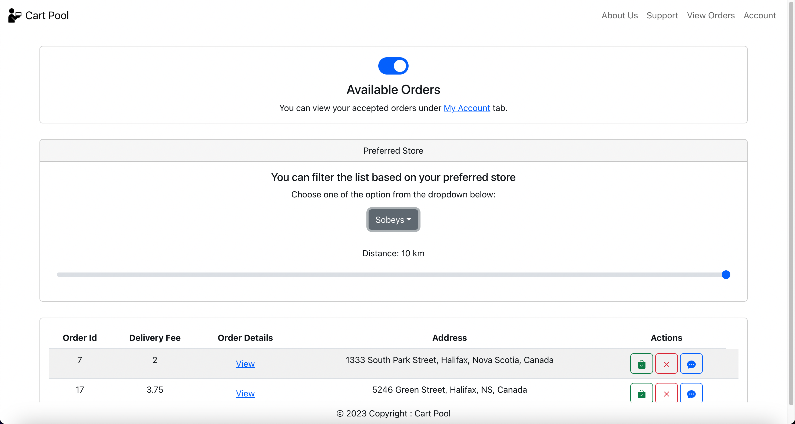
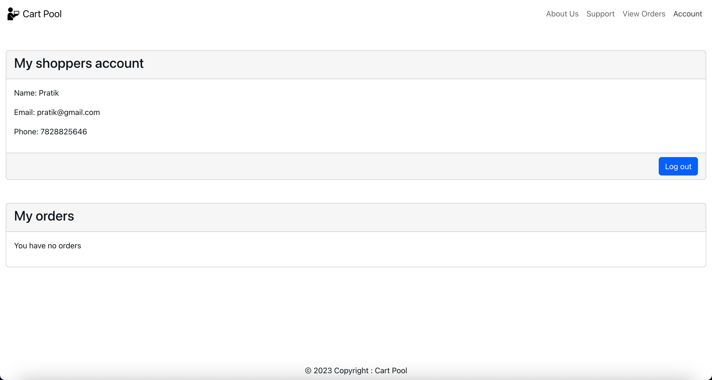
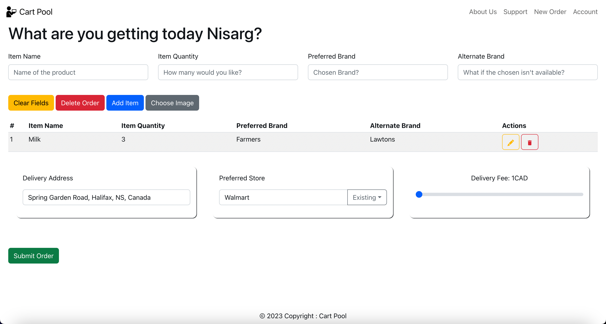
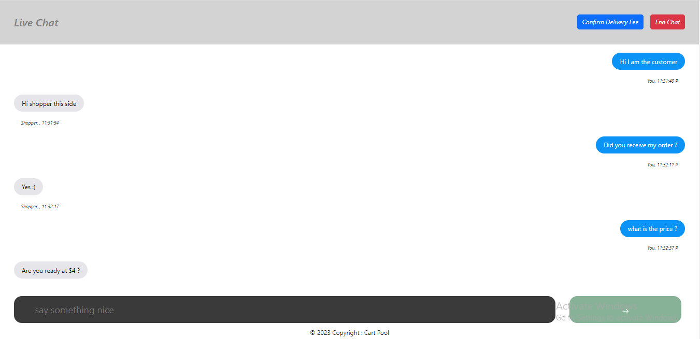
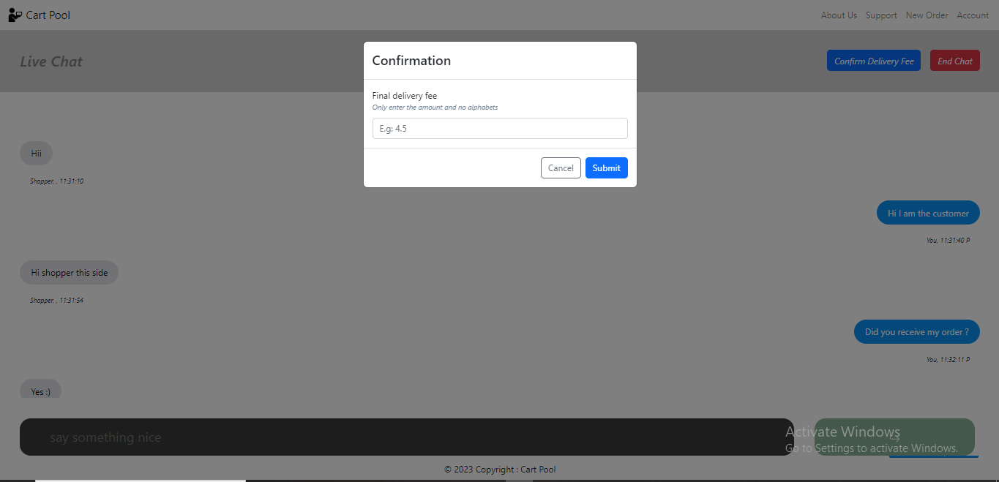
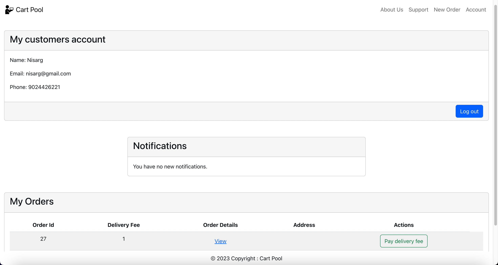

# CartPool: A peer to peer delivery app delivery platform for your daily need requirements!

This is a platform where potential customers can connect with shoppers who willing to buy the the groceries and other items from the intended stores nearby and can deliver them to the customers for a small delivery fee. The main idea behind this project is to help customers who are stuck with their work and want to buy daily necessities. This where shoppers, who are going to buy their own stuff can accept the orders by these customer and can deliver them to the customers and can charge a small deliver fee.

&nbsp;

# About the project

This project has two individual node applications and hence will not run if you do not have node installed to install [Node](https://nodejs.org/en) (we suggest using the LTS version).

To check if node and npm has properly been installed run these two commands:

> `node -v`

> `npm -v`

If it returns a version number then node and npm have been correctly installed, if you don't see them please go through the installation documentation on their website to fix the issue

The applications are split for back-end and front-end, you need to instantiate both the node applications for the project to be properly functional.

&nbsp;

# Dependencies

```JSON
"@fortawesome/fontawesome-svg-core": "^6.3.0",
"@fortawesome/free-regular-svg-icons": "^6.3.0",
"@fortawesome/free-solid-svg-icons": "^6.3.0",
"@fortawesome/react-fontawesome": "^0.2.0",
"@stripe/react-stripe-js": "^2.1.0",
"@stripe/stripe-js": "^1.52.0",
"@testing-library/jest-dom": "^5.16.5",
"@testing-library/react": "^13.4.0",
"@testing-library/user-event": "^13.5.0",
"axios": "^1.3.4",
"babel-plugin-macros": "^3.1.0",
"bootstrap": "^5.2.3",
"cdbreact": "^1.5.7",
"crypto": "^1.0.1",
"firebase": "^9.19.1",
"framer-motion": "^9.0.7",
"jsonwebtoken": "^9.0.0",
"mdb-react-ui-kit": "^5.1.0",
"nodemon": "^2.0.21",
"pm2": "^5.2.2",
"react": "^18.2.0",
"react-bootstrap": "^2.7.2",
"react-dom": "^18.2.0",
"react-firebase-hooks": "^5.1.1",
"react-icons": "^4.8.0",
"react-password-checklist": "^1.4.3",
"react-places-autocomplete": "^7.3.0",
"react-router": "^6.10.0",
"react-router-dom": "^6.10.0",
"react-scripts": "^5.0.1",
"react-timer-hook": "^3.0.5",
"use-state-with-callback": "^3.0.2",
"web-vitals": "^2.1.4"
```

> `SendGrid`: This is used as an external service to send emails to the users. In this application we are using this service to send emails for verification code in case the user forgets the password and wants to reset it. An account needs to be created in SendGrid to obtain the API Key to be used in the application. This needs to be replaced in the backend code application.

Link: https://sendgrid.com/

Location to make the change: `backend/services/entities.services.js` (Line number: 97)

> `Google Firebase`: This is used as a Real Time Database for the live chat functionality. In this application, Firebase is used to store the data about chat and also notify the respective parties about the chat notifications.

Link: https://firebase.google.com/

Note: A project needs to be created with WebApp as a base template and get the necessary keys needed for the React App

Location to make the change:

- `frontend/src/Components/LiveChat.js` (Line number: 17-23)
- `frontend/src/Components/MyAccount.js` (Line numbers: 14-20)

> `Stripe`: This is used for integrating the payment gateway in to a React App. In our application this is used as a gateway to process payments for Delivery Fee and Invoice Amount from the customers.

Link: https://stripe.com/en-ca

Location to make the change:

- `frontend/src/Components/PaymentGatewayContainer.js` (Line number: 7)

- `backend/.env` (Line number: 3)

The entire instructions on how to make the API calls from the frontend to backend are present in the [README.md](https://github.com/sagarshah97/cartpool/blob/main/backend/README.md)

&nbsp;

# Getting Started

Clone the project using this command.

### `https://github.com/sagarshah97/cartpool.git`

Once the project has been cloned run the below commands in both the folders (frontend and backend) . You will need to use node package manager (npm) that comes bundled with node to run all the below commands:

This command will install all the required project dependencies

> `npm install`

This will start a local instance of the node application on your PC

> `npm start`

Open [http://localhost:3000](http://localhost:3000) to view it in your browser, this view is food for development as any changes you make in the code will be refreshed and show up.

&nbsp;

# Hard Coded Dependencies

You should use your own API keys for all these dependencies, although these are not required but if these aren't added the functionalities mentioned for each of them will not work and might ruin the user experience

_Google API Key (Firebase, PlacesAutoComplete)_ - Live Chat and Places AutoComplete

_Stripe API Key_ - Payment Gateway

_Email API Key_ - To send emails to the customers

The page will reload when you make changes.\
You may also see any lint errors in the console.

# Building the application:

Clone the repo, Open the project folder group 26 in `IntelliJ` in the new window. Right click and build the module to compile. No other dependencies are needed build the application.

For VSCode, navigate to each `frontend` and `backend` (backend only if running on localhost) folders respectively and run the following commands in the given order:

> `npm install` OR `npm i`

> `npm start`

For Node.js, you will need to have Node.js and npm (Node Package Manager) installed on your system. You can download the latest version of Node.js from the official website, and npm will be installed automatically along with Node.js.

&nbsp;

# Testing the project

Use this command to run the test cases present `backend` folder

> `npm run coverage`

&nbsp;

This project was bootstrapped with [Create React App](https://github.com/facebook/create-react-app).

# Code Smells and refactoring

The entire report on code smells and refactoring done to remove them can be found under `Code Smells` folder.

Overview:

> Code Smell, Status and Justification

_Redundant Jump_: Not Fixed (Empty returns can be beneficial in Node.js when a method is returning a value as a Promise because it helps to improve the readability and maintainability of the code)

_Unexpected Empty Constructor_: Fixed (Removed the empty constructor that was initially introduced but later seemed redundant
Uninitialized Variable Fixed The variable was initialized as `const`)

_Cognitive Complexity_: Fixed (Decomposed the long method into multiple sub-methods to maintain the Single Responsibility Principle and maintain lower complexity)

_Unused Variable Assignment_: Fixed (The variable was removed as it was not utilized further to access any data from the variable)

_Unused Variable Declaration_: Fixed (The variable was removed as it was not utilized further to access any data from the variable)

_Undefined Declaration_: Fixed (The variable was initialized as `const`)

_CORS_: Not Fixed (Using cors to allow localhost to access this server)

Following are the screenshots from the sonarqube:

- https://git.cs.dal.ca/courses/2023-winter/csci-5308/group26/-/blob/main/Images/SonarQube1.png
  [Sonarqube 1](Images/SonarQube1.png)

- https://git.cs.dal.ca/courses/2023-winter/csci-5308/group26/-/blob/main/Images/SonarQube2.png
  [Sonarqube 2](Images/SonarQube2.png)

## References

- Table creation: [Editable Table in ReactJs](https://github.com/chrisblakely01/react-creating-a-table)

- Live chat with Firebase: [Live Chat](https://github.com/fireship-io/react-firebase-chat)

- Backend structure with MVC: [NodeJs rest apis with express and sql](https://www.designmycodes.com/examples/node-js-rest-api-express-mysql.html)

- Payment gateway for users: [Payment Gateway (Stripe)](https://github.com/NikValdez/ReactStripeTutorial)

&nbsp;

# Features

- _Sign up (for both shopper and customer)_: This functionality will let the user (Shopper/Customer) register for the application for the desired role.
- _Log in for both shopper and customer_: This will let the user login with the credentials created using signup
- _Customer’s order_: This will allow user to order items
- _Shopper makes themselves online_: Shoppers will be able to make themselves online, which would imply that they are ready to accept requests. They can set the location and range for the delivery.
- _Shopper accepts the requests_: Shoppers can see the lists of requests raised within the range they set up earlier by clicking the accept button.
- _Bargaining_: This feature will provide user the option to bargain the delivery price
- _Payment received_: This functionality will provide the user with payment gateway. Shopper can upload the invoice of the order and customer can view the invoice and pay.
- _JWT Authentication_: Token based authentication which verifies the session of the user
- _Places Autocomplete_: Use google maps API to get accurate addresses

&nbsp;

# User scenarios

> All the user scenarios and Sonarqube results are stored in the `Images` folder.

1. Landing page: Whenever a user first visits our webpage, the following image will be displayed to the user which consists of our landing page:
   https://git.cs.dal.ca/courses/2023-winter/csci-5308/group26/-/blob/main/Images/WelcomePage.png
   

2. Login page: Once the user has logged in the application, following page will be shown to the user (Customer Login):
   https://git.cs.dal.ca/courses/2023-winter/csci-5308/group26/-/blob/main/Images/customerLogin.png
   
   (Shopper Login):
   https://git.cs.dal.ca/courses/2023-winter/csci-5308/group26/-/blob/main/Images/Loginpage.png
   

3. Sign Up Page: If the user account does not exist, the user can sign up on the platform to enroll as either a customer or a shopper. Furthermore a password checklist is also implemented to enhance security:
   https://git.cs.dal.ca/courses/2023-winter/csci-5308/group26/-/blob/main/Images/Signup.png
   

4. Shopper Dashboard: Once the shopper has logged in our application, he needs to make himself online to view the order. After changing the status to online he/she can view the upcoming orders requested by customers in the Shopper dashboard. Here, he/she has the option to filter these orders by either Stores, Distance or both. For distance, we are collecting the live location of the shopper to calculate the distance of every order to be delivered.
   https://git.cs.dal.ca/courses/2023-winter/csci-5308/group26/-/blob/main/Images/ShopperDashboard.png
   
   https://git.cs.dal.ca/courses/2023-winter/csci-5308/group26/-/blob/main/Images/ShopperOrders.png
   

5. Shopper profile: A shopper can also view his/her profile in the My Account tab and also the Accepted orders:
   https://git.cs.dal.ca/courses/2023-winter/csci-5308/group26/-/blob/main/Images/Profile.png
   

6. Customer order page: A customer, once logged in, can place a new order from the homepage. He has the option to either enter item details manually or upload an image of list or do both. Further he/she has the option to edit the order before submitting them. After that, customer has the option to add the delivery location, where we are using `Google Places Autocomplete` API to improve USer Experience. After that he/she has the option to add the Preferred Store (E.g.: Walmart, Sobeys, Atlantic SuperStore) and finally add the proposed delivery fee for completing the orders:
   https://git.cs.dal.ca/courses/2023-winter/csci-5308/group26/-/blob/main/Images/CustomerOrder.png
   

7. Negotiation : The shopper has the option to initiate the live chat with the customer to negotiate the delivery fee in case they feel the proposed fee is less in comparison with the volume of the order. The customer will be notified about the initiated chat and can talk to the shopper on our platform using our live chat functionality. Once the negotiation is done, the customer has the option to enter the final delivery fee:
   https://git.cs.dal.ca/courses/2023-winter/csci-5308/group26/-/blob/main/Images/Livechat2.png
   
   https://git.cs.dal.ca/courses/2023-winter/csci-5308/group26/-/blob/main/Images/Livechat1.png
   

8. Payment: Once the order has been accepted by the shopper, the customer has the option to make the payment of the delivery fee. This payment wil be handled by the platform and will only be forwarded to the shopper once the shopper completes and delivers the order to the customer.
   https://git.cs.dal.ca/courses/2023-winter/csci-5308/group26/-/blob/main/Images/CustomerAccountpayment.png
   
